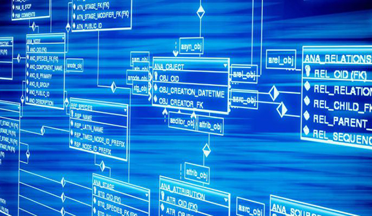

 
Comparatives amb altres bases de dades
 
 
Prometheus: Prometheus és una base de dades i sistema de monitoratge de codi obert que també es centra en dades de series temporals. La principal diferència entre Prometheus i InfluxDB radica en el seu enfocament. Prometheus està dissenyat específicament per a la monitoratge de sistemes i aplicacions, mentre que InfluxDB ofereix una gamma més àmplia d'ús, incloent-hi telemetria IoT, dades d'aplicacions, etc.

Elasticsearch: Elasticsearch és una plataforma de cerca i analítica distribuïda que també pot emmagatzemar dades de series temporals. Encara que ofereix una gran flexibilitat i pot ser utilitzada per a diversos tipus de dades, inclòs dades de series temporals, no està específicament optimitzada per a aquest ús com ho està InfluxDB. InfluxDB es mes eficient en el rendiment i emmagatzematge per a dades de series temporals específiques.

TimescaleDB: TimescaleDB és una base de dades SQL extensible que està optimitzada per a dades de series temporals. A diferència d'InfluxDB, que utilitza un model de dades de sèries temporals natius, TimescaleDB ofereix compatibilitat amb SQL, el que pot ser beneficiós per a equips que ja utilitzen aquesta tecnologia. No obstant això, InfluxDB tendeix a ser més senzill d'implementar i utilitzar per a aplicacions específiques de series temporals.

OpenTSDB: OpenTSDB és una base de dades de series temporals distribuïda i escalable. És una opció popular per a emmagatzemar i consultar grans volums de dades de series temporals. Encara que comparteix moltes característiques amb InfluxDB, com la capacitat de gestionar dades de series temporals a gran escala, InfluxDB tendeix a ser més fàcil de configurar i administrar, especialment per a aquells que busquen una solució més lleugera i modular.

En resum, tots aquests sistemes tenen els seus propis avantatges i desavantatges segons les necessitats específiques del projecte. InfluxDB destaca per la seva facilitat d'ús, escalabilitat i eficiència en l'emmagatzematge i consulta de dades de series temporals, especialment en escenaris d'IoT, monitoratge i analítica de dades en temps real.

