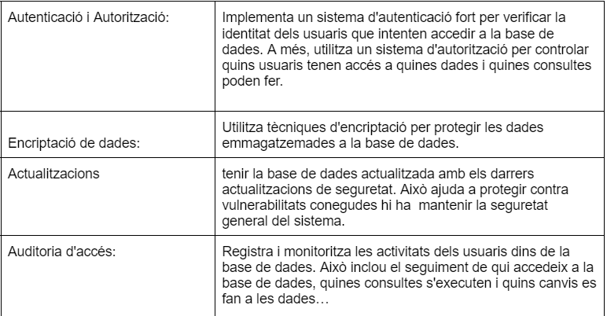
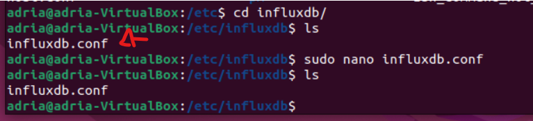

 
Un cop realitzada la instal·lació realitza una securització de la mateixa. Quin programa realitza aquesta tasca? Realitza una securització de la instal·lació.
 

 
Quines són les instruccions per arrancar / verificar status / apagar servei de la base de dades del SBGB escollit a nivell sistema operatiu?
 

 
A on es troba i quin nom rep el fitxer de configuració del SGBD escollit?

