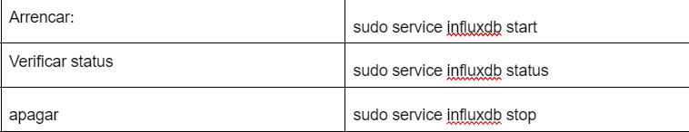

 
Un cop realitzada la instal·lació realitza una securització de la mateixa. Quin programa realitza aquesta tasca? Realitza una securització de la instal·lació.
 

 
Quines són les instruccions per arrancar / verificar status / apagar servei de la base de dades del SBGB escollit a nivell sistema operatiu?
 

 
A on es troba i quin nom rep el fitxer de configuració del SGBD escollit?

 
A on es troben físicament els fitxers de dades (per defecte). Com ho has sabut?
 
El fitxer etc/influxdb.conf
 
 
El servei de SGBD escollit en quins ports escolta. Quina modificació/passos caldrien fer per canviar aquest port a un altre per exemple? Important: No realitzis els canvis. Només indica els passos que faries.

 
 
Incloure en la documentació un petit apartat a on s'expliqui com realitzar la connexió a la BD. Demostra que us podeu connectar al SGBD a través d’una eina de gestió de BD o  a través d’un program
 
 
Per connectar-se mitjançant una eina de gestió de BD: Utilizaria una eina de gestió de BD com InfluxDB Studio o Chronograf per connectar-la a la BD d'InfluxDB.
 
Obriu l'eina de gestió de BD.
 
Proporcioneu l'adreça IP del servidor on està allotjada la BD d'InfluxDB.
 
Especifiqueu el nom d'usuari i la contrasenya si estan configurats.
 
Seleccioneu la base de dades a la qual us voleu connectar.
 
Feu clic al botó de connexió per establir la connexió.
 
